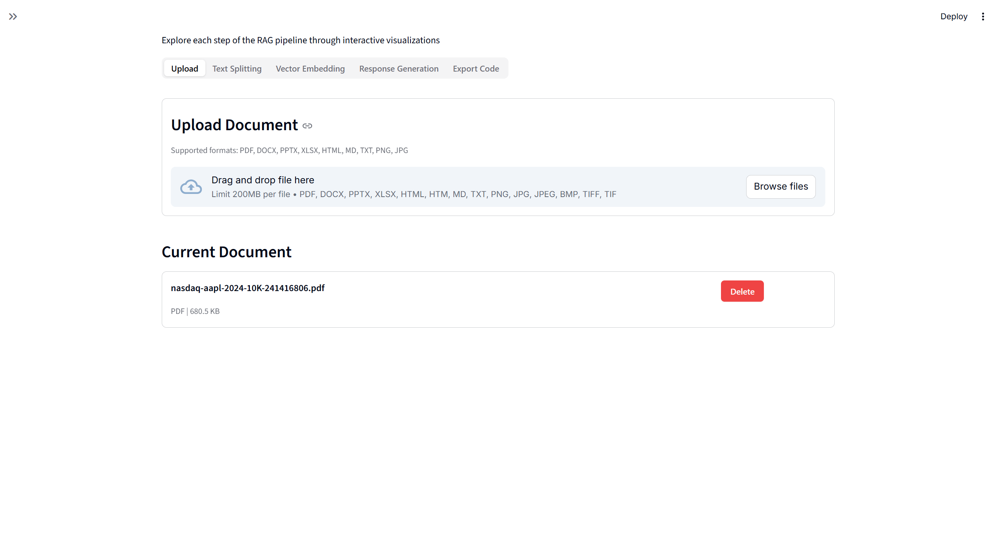
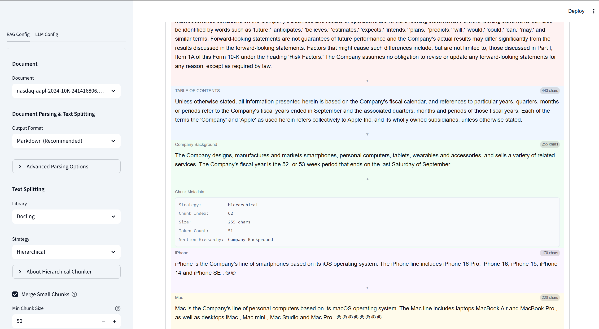
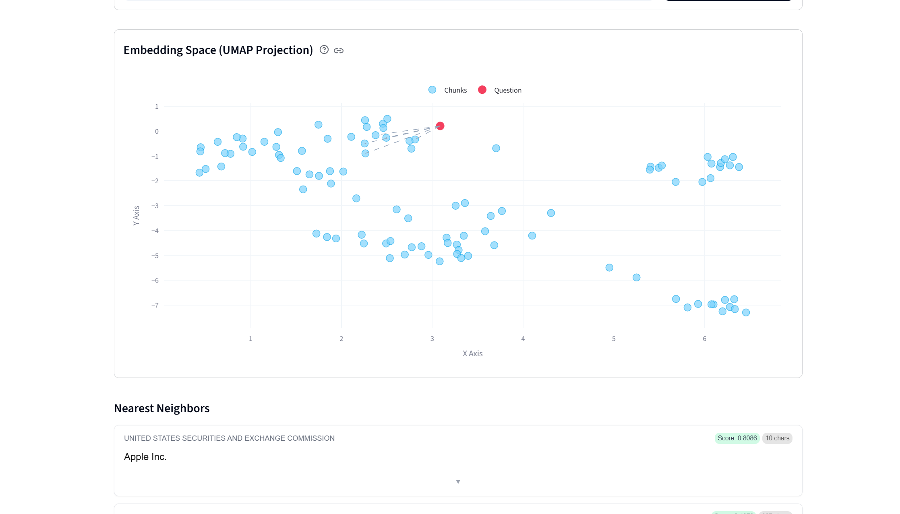
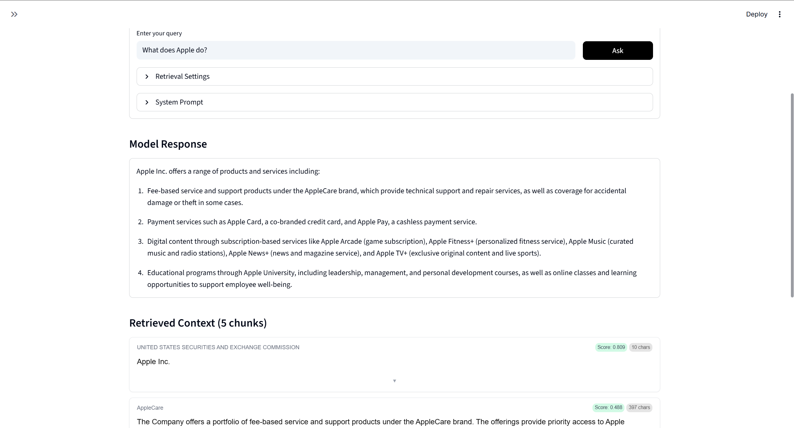

# RAG Lens

A visual sandbox for experimenting with RAG (Retrieval-Augmented Generation) configurations.

## Overview

RAG Lens helps developers understand and optimize their RAG pipelines through interactive visualizations. Experiment with document parsing, chunking strategies, embedding models, and retrieval configurations—all running locally on your machine.

## Requirements

- Python 3.9, 3.10, 3.11, or 3.12
- 4GB+ RAM recommended (for embedding models)
- Optional: CUDA-compatible GPU for acceleration

## Installation

### From PyPI

```bash
pip install rag-lens
```

### From Source

```bash
git clone https://github.com/rag-lens/rag-lens.git
cd rag-lens
pip install -e .
```

### Development Dependencies

For contributing to the project, install development tools:

```bash
pip install rag-lens[dev]
```

### GPU Acceleration

For faster document parsing and embedding generation with CUDA-enabled GPUs, install PyTorch with CUDA support. Visit [pytorch.org](https://pytorch.org/get-started/locally/) for installation instructions.

## Usage

Simply run the CLI command to launch the Streamlit app:

```bash
rag-lens
```

This opens the app in your browser at `http://localhost:8501`.

### API Key Setup

To use LLM features (query generation with OpenAI, Anthropic, etc.), configure your API keys:

1. Run `rag-lens` once to create the configuration directory
2. Navigate to `~/.rag-lens/` (or `%USERPROFILE%\.rag-lens\` on Windows)
3. Edit the `.env` file and add your API key:
   ```bash
   # For OpenAI
   OPENAI_API_KEY=sk-your-key-here

   # For Anthropic
   ANTHROPIC_API_KEY=sk-ant-your-key-here
   ```
4. Save the file and refresh the app

**Note:** API keys are stored securely in `.env` and never saved to session files. For local models (Ollama, LM Studio), no API key is required.

### CLI Options

```bash
rag-lens --help

Options:
  -p, --port INTEGER  Port to run the Streamlit app on (default: 8501)
  -h, --host TEXT     Host to bind the Streamlit app to (default: localhost)
  --version           Show the version and exit.
  --help              Show this message and exit.
```

### Running as a Python Module

```bash
python -m rag_lens
```

## Features

### Document Upload
- Multi-format support: PDF, DOCX, PPTX, XLSX, HTML, Markdown, TXT, Images
- Powered by Docling for advanced document parsing
- OCR support for scanned documents and images
- Table structure extraction and preservation
- Content filtering by document element type
- Configurable output formats (Markdown, HTML, DocTags, JSON)



### Chunk Visualization
- Multiple chunking strategies (Hierarchical, Hybrid)
- Token-aware chunking with configurable limits and overlap
- Visual chunk cards with metadata badges
- Section hierarchy breadcrumbs for context
- Overlap highlighting
- Expandable context previews
- Configurable metadata fields



### Embedding Explorer
- Multiple embedding models via sentence-transformers
- 2D UMAP visualization of embedding space
- Interactive Plotly scatter plots
- Outlier detection and analysis
- Color coding by document or cluster
- Click-to-inspect chunk details



### Query Testing
- Semantic search with adjustable top-K results
- Cosine similarity scoring
- Retrieved chunk highlighting
- Query visualization on embedding plot
- LLM integration for RAG answer generation
- Support for OpenAI, Anthropic, and OpenAI-compatible local models



### Code Export
- Production-ready Python code generation
- Exact configuration preservation
- Complete requirements.txt with dependencies
- Ready-to-run scripts for deployment

## Storage

All data is stored locally in `~/.rag-lens/`:

```
~/.rag-lens/
├── documents/          # Uploaded raw documents
├── chunks/             # Processed chunk data
├── embeddings/         # Cached embeddings
├── indices/            # FAISS vector indices
├── session_state.json  # UI state persistence
├── llm_config.json     # LLM configuration
└── rag_config.json     # RAG pipeline settings
```

No data is transmitted to external servers except when using LLM APIs for query generation.

## Development

### Setup

```bash
# Clone the repository
git clone https://github.com/rag-lens/rag-lens.git
cd rag-lens

# Install in development mode
pip install -e ".[dev]"
```

### Running Tests

```bash
pytest
```

### Code Formatting

```bash
black rag_lens
ruff check rag_lens
```

## Contributing

Contributions are welcome! Please feel free to submit a Pull Request. For major changes, please open an issue first to discuss what you would like to change.

### Development Guidelines

See [CLAUDE.md](CLAUDE.md) for coding standards and development philosophy.

## License

MIT License - see LICENSE file for details.

